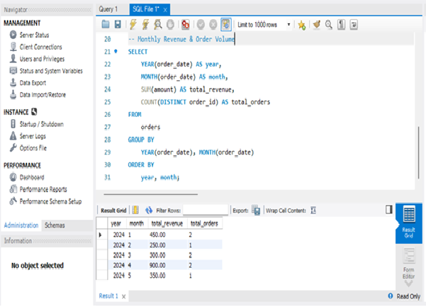
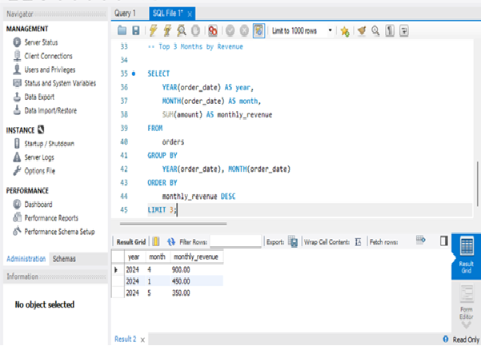
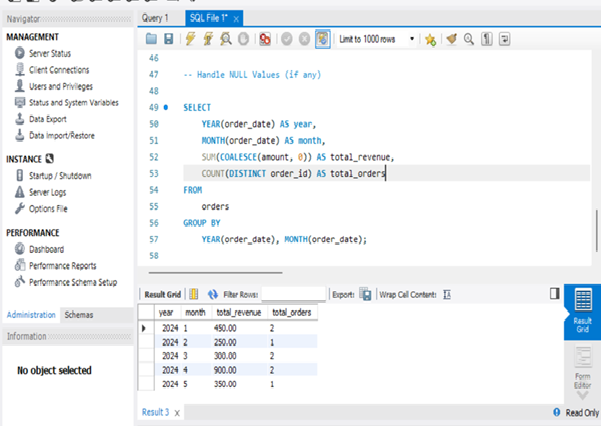

# 📊 Task 6 - Sales Trend Analysis (SQL)

## 📌 Objective
Analyze monthly revenue and order volume using SQL aggregation functions.

## 🧰 Tools Used
- MySQL
- GitHub for submission

## 🧪 Dataset Schema
**Table:** `orders`

| Column Name | Data Type   | Description             |
|-------------|-------------|-------------------------|
| order_id    | INT         | Unique order identifier |
| order_date  | DATE        | Date of the order       |
| amount      | DECIMAL     | Order amount (revenue)  |
| product_id  | INT         | ID of the product       |

## 📁 Files Included
- `sales_trend_sql.sql` - SQL script with all queries
- `output_screenshots/` - Query results (screenshots)
- `README.md` - Project explanation

## 🔎 Key Insights
- Grouped data by `YEAR()` and `MONTH()`
- Used `SUM()` for total revenue
- Used `COUNT(DISTINCT order_id)` for order volume
- Identified top 3 months by revenue

## 📷 Result Queries Preview

### 📌 Monthly Revenue and Order Volume

### 📌 Top 3 Months by Revenue

### 📌 Handling NULLs in Revenue

🧑‍💻 Author
Name: Samiksha Babasaheb Ugale
GitHub Profile: github.com/yourusername
